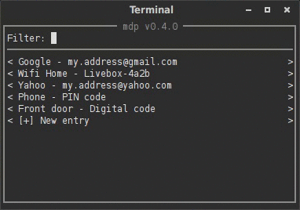

mdp
===

## Name
mdp - User friendly password storage tool.

It comes from the french "*Mot De Passe*"

## Description
this program can store your passwords on a encrypted file and allows you to
access it in a very simple way.



Each password has 3 information:
* Domain : (or service or URL) where the account is registered
* Login : identifier for the account
* Password

This program doesn't interact with keyring or any other key manager.
All the passwords are stored in a human readable text file; which is encrypted
with a master password using the highly secure AES algorithm.

## Installation
mdp has only be tested on GNU/Linux, but it should work on other platforms.

It depends on:
* Python 3
* [Pyperclip](https://pypi.python.org/pypi/pyperclip/1.5.11)
* [Urwid](http://urwid.org/)
* [pycrypto](https://www.dlitz.net/software/pycrypto/)

In Debian and derivative these commands will install those libraries:
```bash
$ sudo pip3 install pyperclip
$ sudo apt-get install python3-urwid
```
Python 3 an pycrypto are already shipped with the system.

## Usage
The program is fully interactive :
```sh
$ mdp.py
```

You can also use these parameters:

`-h --help`
Output some help and exit

`-v --version`
Output version information and exit

## License
Copyright © 2015 Pierre Faivre. This is free software, and may be redistributed
under the terms specified in the LICENSE file.

